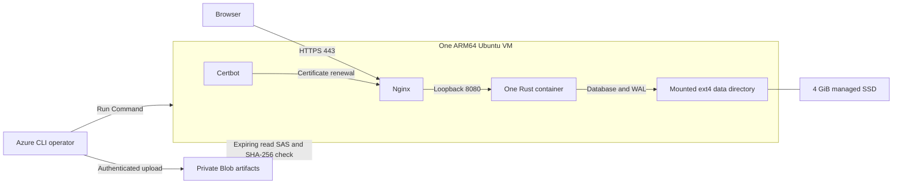

# Azure: a persistent live-feed deployment

This runbook deploys Cyberwatch with live public feeds and a durable database in
the `LapinAMK-Student-YAMKDevops-SANDBOX` subscription
(`afe8ae0d-d866-47a9-bc56-e1f4475e6cc6`). The deployment entry point is
[`deploy/azure/deploy.ps1`](../deploy/azure/deploy.ps1); infrastructure is defined
in [`deploy/azure/main.bicep`](../deploy/azure/main.bicep). Run the PowerShell
commands from the project root. Deployment creates billable Azure resources.

The live application is deployed behind valid HTTPS. At 09:29:53 UTC on
8 September 2026, verification observed 2,226 real records, live mode enabled,
protected reader access and rejected unauthorized refresh requests. The first
completed ingestion succeeded for 28 of 38 sources; 10 reported upstream errors.
A full VM reboot preserved the data filesystem UUID, an inserted verification
nonce and the existing records; the nonce's temporary table was removed after
verification. Record count increased from 2,226 to 2,228 as live ingestion
continued. HTTPS and service/timer checks passed after reboot. The separate
off-VM backup and local restore check preserved all 2,226 backed-up item IDs.

The source security gate passed at 10:14:12 UTC. The initial installed-host inventory gate
reported 328 HIGH and 10 CRITICAL associations through two kernel utility
packages; it has not been waived. Vendor review also identified the initial
6.17 Azure kernel stream as end of life. The host now runs `6.8.0-1067-azure`
through the maintained `linux-azure-lts-24.04` package. After a successful trial
boot, 13 reviewed obsolete 6.17 packages were removed. A second ordinary boot
passed without a version-specific boot pin; the data UUID, 2,232 records and
required services/timers remained intact. This transition does not establish
that every kernel advisory is resolved. The final package inventory scan failed
at 10:25:45 UTC with 1,504 HIGH and 45 CRITICAL associations for 175 unique CVEs
across nine kernel-source packages, with no fixed versions reported. The
maintained stream is represented differently in vendor matching, so those
association counts are not a before/after exploitability measure. No findings
were waived; see the [scoped security evidence](evidence/azure-security-status.md).

The [final HTTPS check](evidence/azure-live-final.json), recorded at 10:16:42 UTC,
passed 17 checks and observed 2,232 live records. The
[final host check](evidence/azure-final-runtime.json) confirms the ordinary LTS
boot and records no loaded `nfsd` module or listening NFS server port. These
runtime observations do not replace the package vulnerability scan.

The initial Caddy proxy candidate failed scanning with 38 HIGH and 1 CRITICAL
package findings and was rejected before application deployment. The deployed
design uses Ubuntu-maintained Nginx and Certbot; see the
[rejected candidate scan status](evidence/azure-proxy-initial-security-status.json).

| Created resource | Identity |
| --- | --- |
| Resource group | `rg-cyberwatch-yamk-swe` |
| VM | `cyberwatch-yamk` |
| Public IPv4 | `135.225.83.121` |
| HTTPS URL | [Open Cyberwatch](https://cyberwatch-yamk-afe8ae-20260908.swedencentral.cloudapp.azure.com) |
| Private artifact storage | `cywqqv6z273n7dfk`, container `artifacts` |
| Data disk | `cyberwatch-yamk-data` |

All listed resources belong to the subscription above in `swedencentral`.
The data disk ID is
`/subscriptions/afe8ae0d-d866-47a9-bc56-e1f4475e6cc6/resourceGroups/rg-cyberwatch-yamk-swe/providers/Microsoft.Compute/disks/cyberwatch-yamk-data`.
The evidence records the loaded image identities, live checks and observation
times without credentials; current health and source outcomes can change.

## 1. Understand the architecture and costs

One ARM64 `Standard_B2pts_v2` Linux VM in `swedencentral` runs one Cyberwatch
container behind host Nginx. Nginx terminates HTTPS and protects reader access
with Basic Auth; Certbot obtains and renews the TLS certificate. The application
also has a separate bearer token for administrative
refresh. The database resides on a 4 GiB managed Standard SSD mounted by the VM;
the 32 GiB OS disk is separate. A Standard static IPv4 address supplies the public
endpoint and an Azure DNS hostname. Only HTTP and HTTPS are allowed inbound; the
application port and SSH are closed. Azure Run Command provides administration.



A private Standard LRS Blob container temporarily holds the exported images.
The operator uploads through Azure CLI, and the VM downloads through a short-lived
read-only SAS before checking the artifact hash. The Blob endpoint is public but
requires authentication; anonymous Blob access is disabled. This avoids a
dedicated registry and its fixed daily charge. It does not provide private
network transport to Storage. The artifact lifecycle deletes objects under
`artifacts/` after seven days; it is not a database backup policy.

The VM provides 2 ARM CPU cores and 1 GiB RAM. B-series CPU credits suit a small,
bursty teaching service; sustained ingestion can consume those credits and slow
the application. Its 20% normalized CPU baseline is not two continuously busy
cores. Start with one replica and bounded ingestion. Check memory, disk space,
CPU-credit metrics and source health before increasing load. See Microsoft's
[Bpsv2 specifications](https://learn.microsoft.com/en-us/azure/virtual-machines/sizes/general-purpose/bpsv2-series).

These are public consumption retail estimates retrieved on **8 September 2026**,
in EUR, using 730 running hours per month. They are not a subscription invoice,
student-credit entitlement, reservation quote, tax-inclusive price or spending cap.

| Resource in Sweden Central | Retail unit price | Estimated month |
| --- | ---: | ---: |
| B2pts_v2 Linux VM | EUR 0.007385/hour | EUR 5.39 |
| E4 Standard SSD LRS OS disk, 32 GiB | EUR 2.060793/month | EUR 2.06 |
| E1 Standard SSD LRS data disk, 4 GiB | EUR 0.257599/month | EUR 0.26 |
| Standard static IPv4 | EUR 0.004293/hour | EUR 3.13 |
| **Fixed subtotal** | | **EUR 10.84/month** |

The corresponding USD subtotal is **USD 12.63/month**. Small Blob artifacts,
disk transactions, backups and outbound data add usage charges; actual usage
determines the amount. There is no ACR, Bastion, NAT Gateway, load balancer or Log
Analytics workspace in this template. ACR Basic alone was EUR 0.143053/day
(about EUR 4.29 for 30 days), so it would be a material addition to this small VM.

Verify prices with the [Azure Retail Prices API](https://learn.microsoft.com/en-us/rest/api/cost-management/retail-prices/azure-retail-prices),
[managed-disk pricing](https://azure.microsoft.com/en-us/pricing/details/managed-disks/)
and [registry tiers](https://learn.microsoft.com/en-us/azure/container-registry/container-registry-skus).
The exact retail meters used were `B2pts v2` in product
`Virtual Machines Bpsv2 Series`, `E4 LRS Disk`, `E1 LRS Disk`, and
`Standard IPv4 Static Public IP`, with `armRegionName=swedencentral`,
`priceType=Consumption` and `currencyCode=EUR`. Exclude Windows, Spot and
low-priority VM prices when reproducing the comparison.

This anonymous query reproduces the five selected EUR meters:

```powershell
$PriceFilter = "armRegionName eq 'swedencentral' and priceType eq 'Consumption' and ((productName eq 'Virtual Machines Bpsv2 Series' and meterName eq 'B2pts v2') or meterName eq 'E4 LRS Disk' or meterName eq 'E1 LRS Disk' or meterName eq 'Standard IPv4 Static Public IP' or meterName eq 'Basic Registry Unit')"
$PriceUri = 'https://prices.azure.com/api/retail/prices?api-version=2023-01-01-preview&currencyCode=EUR&$filter=' + [Uri]::EscapeDataString($PriceFilter)
(Invoke-RestMethod -Uri $PriceUri).Items |
    Select-Object productName, meterName, retailPrice, unitOfMeasure, currencyCode
```

### Why a VM for this application?

SQLite/libSQL stores the database locally and uses WAL sidecars. Keep all of
them on the same local filesystem and allow one application writer. A managed
block disk mounted by one VM provides that model. Do not add application replicas
or overlapping rolling updates around this database.

Container Apps Consumption can be attractive for a disposable, scale-to-zero
demo, but its local storage is ephemeral and its durable mounts use Azure Files
SMB/NFS. SQLite WAL requires same-host shared memory and does not support a
network filesystem. One replica alone does not make an Azure Files mount local.
Moving this live service to that architecture requires a suitable external
database or a separately validated storage design. See
[Container Apps storage](https://learn.microsoft.com/en-us/azure/container-apps/storage-mounts)
and [SQLite WAL limitations](https://www.sqlite.org/wal.html).

Container Apps offers monthly shared free grants of 180,000 vCPU-seconds,
360,000 GiB-seconds and 2 million requests. Those are finite grants, not a
guarantee of a free always-on service; live polling also prevents the intended
scale-to-zero pattern. It additionally requires Linux AMD64 images, whereas
this VM uses ARM64. See
[Container Apps billing](https://learn.microsoft.com/en-us/azure/container-apps/billing)
and [container requirements](https://learn.microsoft.com/en-us/azure/container-apps/containers).

## 2. Preflight the subscription and tools

Use Azure CLI, Docker Engine with Linux ARM64 build support, PowerShell, Python
3.11 or newer, OpenSSL and `ssh-keygen`. The wrapper invokes `python` from PATH.
On Windows, the helper can also find OpenSSL installed with Git for Windows.
The initial operator session used Azure CLI 2.90. Authentication is interactive
when there is no existing session:

```powershell
az version
az login
$AzSubscription = 'afe8ae0d-d866-47a9-bc56-e1f4475e6cc6'
az account show --subscription $AzSubscription --query '{name:name,id:id,state:state}' -o table
docker version
docker buildx ls
python --version
Get-Command ssh-keygen
```

Confirm the displayed name and ID before continuing. Use explicit
`--subscription` arguments for operations, so another CLI default does not
redirect a deployment. The confirmed role was Contributor: this can create the
resources here, but cannot grant data-plane roles or create arbitrary RBAC role
assignments. The template therefore creates no role assignments. The upload
flow uses the storage account key through the operator's authorized management
access; keep keys and SAS values out of command transcripts and source control.

Check provider registration, allowed location, quota and VM restrictions:

```powershell
foreach ($AzProvider in @('Microsoft.Compute', 'Microsoft.Network', 'Microsoft.Storage')) {
    az provider show --namespace $AzProvider --subscription $AzSubscription --query '{provider:namespace,state:registrationState}' -o table
}
az vm list-usage --location swedencentral --subscription $AzSubscription -o table
az vm list-skus --location swedencentral --size Standard_B2pts_v2 --all --subscription $AzSubscription --query '[].{name:name,restrictions:restrictions}' -o json
```

Provider registration was initiated for this deployment. Wait for `Registered`
before resource creation. Confirm available quota and actual allocation rather
than assuming a retail price implies SKU availability. The selected Ubuntu
24.04 ARM64 image version is `24.04.202608270` in the template. Avoid `latest` or
daily images when recording reproducible evidence.

## 3. Review the plan before provisioning

Read the deployment script and Bicep parameters. Choose a dedicated resource
group containing only this deployment. The Bicep plan includes one VM, its NIC,
NSG and VNet, one public IP, two managed disks, and a private artifact storage
account/container with a seven-day artifact lifecycle. Data-disk deletion is
`Detach` when deleting the VM. Deleting the entire resource group still deletes
the data disk.

Use the same parameter set for each orchestrator action:

```powershell
$AzDeploy = @{
    SubscriptionId = 'afe8ae0d-d866-47a9-bc56-e1f4475e6cc6'
    ResourceGroup = 'rg-cyberwatch-yamk-swe'
    Location = 'swedencentral'
    NamePrefix = 'cyberwatch-yamk'
    DnsLabel = 'cyberwatch-yamk-afe8ae-20260908'
    Image = 'cyberwatch-size-optimized:local'
}
.\deploy\azure\deploy.ps1 -Action what-if @AzDeploy
```

Choose a different DNS label for a separate deployment; the label must be
available in the region. The `what-if` action prepares the operator key and
creates the dedicated tagged resource group if absent, then previews its
resources. It does not create the VM. It refuses to use an existing group
without the `project=Cyberwatch` tag. Review `reports/azure/what-if.json` and the
proposed resource IDs. Generated parameters are in
`reports/azure/parameters.json`; operator keys are in `secrets/azure/`.
Both directories are excluded from source control. Keep private key material
out of course evidence.

The first resource-group attempt was rejected by the school's required-tag
policy. It created no billable workload. The corrected creation uses the
established school values `CostCentre=4257100`, `Ownerteam=TVT`,
`Servicename=Cyberwatch-YAMK`, `Servicestage=SANDBOX`, an owner derived from the
current CLI user, and a factual description. The optional `-OrgTags` parameter
accepts an operator-reviewed JSON object to override organization tag values.
`GDPR=1` reflects that public live
feeds can reference people; it is an inventory tag, not a compliance finding.
If the school's policy changes, inspect the specific denial and update the
required metadata rather than bypassing the policy.

The public NSG must show only ports 80 and 443 allowed inbound. Do not open port
8080 or SSH to work around an application or Run Command failure. Review the
cost estimate and actual subscription budget independently of the resource
quota. [Azure budgets](https://learn.microsoft.com/en-us/azure/cost-management-billing/costs/tutorial-acm-create-budgets)
send alerts; they do not stop spending automatically.

## 4. Build and identify the artifacts

Build the production target for **linux/arm64**, or reuse the exact previously
reviewed ARM64 production image. The VM's host Python runs the small backup
helper; this deployment does not require exporting the separate maintenance
image. The production container remains distroless. Do not deploy the Dev
Container or compile on the 1 GiB VM.

```powershell
docker build --platform linux/arm64 --target production --tag cyberwatch-size-optimized:local .
.\deploy\azure\deploy.ps1 -Action bundle @AzDeploy
Get-Content .\reports\azure\release.json
```

The `bundle` action exports an existing local image; it does not run `docker
build`. It rejects an export that is not one Linux ARM64 image. If the image was
already built, scanned and reviewed, skip the build command to preserve that
identity. To reuse a previously reviewed Docker-save archive without contacting
Docker, supply `-ImageArchive` and its recorded `-ImageConfigId` together on the
`bundle` action. The archive is validated for its Linux ARM64 configuration,
single expected tag and exact configuration digest. Python's equivalent options
are `--image-archive` and `--image-config-id`.

The orchestrator exports the image, bundles it with the host installer and
checksums, and writes `reports/azure/cyberwatch-azure-bundle.tar.gz` plus
`reports/azure/release.json`. Installation verifies the bundle SHA-256 and
individual file checksums before `docker load`. Record both the exported
file SHA-256 and Docker image identities: a compressed archive hash, Docker
config image ID and registry/manifest digest identify different objects and
must not be relabeled interchangeably. The report names the production config
ID as `imageConfigId`. Release metadata names the proxy strategy
`ubuntu-nginx-certbot`; the installer obtains those host packages from Ubuntu's
repositories. Their exact installed versions are recorded separately from the
immutable application image.
See [Ubuntu's Nginx installation guide](https://ubuntu.com/server/docs/how-to/web-services/install-nginx/)
and [Certbot renewal documentation](https://eff-certbot.readthedocs.io/en/stable/using.html#renewing-certificates).

Review [`production-size.md`](production-size.md) and the existing local
[`security evidence`](evidence/security-verification.md). Rebuilds and base
updates require matching scans and new identities. A local archive hash and
successful Azure rollout do not create hosted GitHub build provenance or prove
an attested release workflow ran.

## 5. Deploy and protect access

Apply the reviewed infrastructure, install the checked bundle, and retrieve
the generated credentials through an encrypted transfer:

```powershell
.\deploy\azure\deploy.ps1 -Action infra @AzDeploy
.\deploy\azure\deploy.ps1 -Action install @AzDeploy
.\deploy\azure\deploy.ps1 -Action credentials @AzDeploy
$AzDeployment = Get-Content .\reports\azure\deployment.json -Raw | ConvertFrom-Json
$AzResourceGroup = $AzDeployment.resourceGroup
$AzVmName = $AzDeployment.vmName
$AzUrl = 'https://' + $AzDeployment.fqdn
```

The `infra` action uses `az deployment group create` and saves its nonsecret
outputs in `reports/azure/deployment.json`. Installation uploads the bundle to
private Blob storage, generates an HTTPS-only read SAS expiring after two
hours, and invokes the host installer using `az vm run-command`. The installer
waits for cloud-init, verifies the payload and data disk, loads the image,
configures systemd, waits for readiness and creates the initial local backup.
It saves a sanitized outcome in `reports/azure/install.json`. Resource allocation,
cloud-init package installation and certificate issuance can take several
minutes; inspect errors before retrying.

The VM's LUN 0 must be the expected 4 GiB disk. The installer refuses the OS disk,
unexpected filesystems, conflicting mounts and nonzero unformatted contents.
It records the ext4 UUID in fstab and makes services require the mount. Repeating
installation preserves an existing managed filesystem, credentials and a valid
previously selected database filename; it replaces the application with one
writer and a brief outage.

The VM generates a strong reader password and a separate application admin
token. Nginx protects dashboard/read requests. Only `POST /api/v1/refresh`
bypasses Nginx Basic Auth because the application requires its own Bearer
authorization on that exact route; sending both schemes in one Authorization
header would conflict. A missing/incorrect admin token is still rejected by
the application. HTTPS must work before credentials
are used over the public endpoint. Do not send either credential to a third
party or place it in a URL, screenshot, shell history or committed file.

The `credentials` action transfers an RSA-OAEP encrypted access record through
Run Command, decrypts it locally with the operator key, and writes excluded
`secrets/azure/access.json`. Its fields are `url`, `readerUsername`,
`readerPassword` and `adminToken`. The helper restricts the secrets directory
to the current operator. Do not attach this file, its parent directory or
sensitive installation diagnostics to the course submission. The public
endpoint is safe to record separately; possession of its URL is not authentication.

Live mode sets `DEMO_MODE=false` and uses a fresh live database. Never reuse the
deterministic demo database: the application deliberately rejects that mix.
Keep the database path and all WAL/SHM sidecars on the managed data disk.

| Host path or service | Purpose |
| --- | --- |
| `/srv/cyberwatch-data/app/` | Durable database; mounted at `/app/data` |
| `/etc/cyberwatch/app.env` | Live-mode, ingestion and database-path settings |
| `/etc/cyberwatch/runtime.env` | Reviewed application image identity |
| `/etc/cyberwatch/secrets/` | Root-protected reader/admin credentials |
| `cyberwatch.service` | One app container, 512 MiB RAM and 1 CPU limit |
| `/etc/nginx/cyberwatch/reader.htpasswd` | Reader password hash, restricted to root and the Nginx group |
| `/etc/letsencrypt/` | TLS certificates and ACME account state on the OS disk |
| `nginx.service` | Host HTTPS proxy, 128 MiB memory, 50% CPU and 64-task limits |
| `certbot.timer` | Ubuntu-managed renewal; validates/reloads Nginx after renewal |
| `cyberwatch-health.timer` | Minute checks; restarts Docker-unhealthy app |
| `cyberwatch-backup.timer` | Daily local backup with seven-snapshot retention |

## 6. Verify real operation and persistence

Record the observation time, URL, VM architecture, loaded image identities and
nonsecret deployment outputs. Check these behaviors against the live endpoint:

1. HTTP redirects to HTTPS, and the TLS certificate is valid for the Azure DNS
   hostname. Anonymous dashboard/API reads are denied.
2. Correct reader credentials reach the dashboard and readiness endpoint.
   Incorrect credentials fail. The direct application port remains unreachable.
3. Administrative refresh rejects a missing/incorrect bearer token and accepts
   the separate valid admin credential through the configured Nginx route.
4. Readiness succeeds, `demo_mode` is false, and source/status responses show
   real live adapters. Inspect ingestion results: upstream feeds may be empty,
   rate-limited or unavailable, so readiness alone is not proof every source
   completed. Keep failures visible rather than fabricating rows.
5. Record database row counts and a few nonsecret stable record identifiers.
   Restart the application once, wait for readiness, and verify those records
   still exist. New ingestion can raise the count between observations.
6. Confirm the database resides on the separate managed data disk, the container
   runs as UID 10001 with the intended read-only/capability restrictions, and
   the runtime logs contain no secrets.

[`tools/smoke.py`](../tools/smoke.py) intentionally validates deterministic
**offline demo** behavior and refuses live mode. Do not use it as a substitute
for these live checks or seed synthetic records into this deployment.

The Azure-specific check validates TLS and the live-mode flag, waits for real
records, tests protected reads and rejected admin requests, and saves sanitized
evidence. By default it does not enqueue a refresh or perform a restart/persistence
test:

```powershell
python deploy/azure/verify-live.py --access-file secrets/azure/access.json --output reports/azure/live-verification.json --wait-seconds 600
```

Add `--enqueue-refresh` to verify a successful administrative Bearer request as
well. This queues real upstream work; use it once for the deployment check,
not repeatedly as a readiness probe.

For a reader check, load credentials privately into this PowerShell process and
print only the nonsecret API response:

```powershell
$AzAccess = Get-Content .\secrets\azure\access.json -Raw | ConvertFrom-Json
$AzReaderBytes = [Text.Encoding]::UTF8.GetBytes($AzAccess.readerUsername + ':' + $AzAccess.readerPassword)
$AzReaderAuth = 'Basic ' + [Convert]::ToBase64String($AzReaderBytes)
$AzReadHeaders = @{ Authorization = $AzReaderAuth }
Invoke-RestMethod -Uri ($AzAccess.url + '/health') -Headers $AzReadHeaders
Invoke-RestMethod -Uri ($AzAccess.url + '/ready') -Headers $AzReadHeaders
Invoke-RestMethod -Uri ($AzAccess.url + '/api/v1/stats') -Headers $AzReadHeaders
Invoke-RestMethod -Uri ($AzAccess.url + '/api/v1/refresh/status') -Headers $AzReadHeaders
```

This explicitly requests a real upstream refresh; it can consume source rate
limits, so do not loop it as a health probe:

```powershell
Invoke-RestMethod -Method Post -Uri ($AzAccess.url + '/api/v1/refresh') -Headers @{ Authorization = 'Bearer ' + $AzAccess.adminToken }
```

Use a bounded Run Command for host checks, for example:

```powershell
$AzDiagnostics = @'
set -eu
systemctl is-active cyberwatch.service nginx.service
findmnt --mountpoint /srv/cyberwatch-data
docker inspect --format '{{.Config.Image}} {{.State.Health.Status}}' cyberwatch
df -h / /srv/cyberwatch-data
'@
az vm run-command invoke --resource-group $AzResourceGroup --name $AzVmName --subscription $AzSubscription --command-id RunShellScript --scripts $AzDiagnostics
```

Use Run Command for bounded host diagnostics and save only sanitized results.
Do not print credential files or dump container environment variables into
diagnostic evidence. Azure control-plane access and Run Command execution are
powerful operator permissions; restrict who can use them.
Microsoft's [Linux Run Command documentation](https://learn.microsoft.com/en-us/azure/virtual-machines/linux/run-command)
describes its agent and output limits. Keep diagnostics bounded and check the
script's own success marker as well as the Azure operation response. Azure's
`Enable succeeded` message reports Run Command transport completion; it does
not establish that an embedded helper succeeded. Inspect the helper's JSON
`status` (`armed`, `passed` or `one-shot-staged`, as appropriate) and any reported
error before continuing. The Azure CLI's exit code alone is insufficient.

The installed persistence helper verifies an actual VM reboot. Schedule the
brief outage and take a backup first, then run:

```powershell
$AzPersistenceBefore = @'
set -eu
python3 /opt/cyberwatch/azure/check-persistence.py before
'@
az vm run-command invoke --resource-group $AzResourceGroup --name $AzVmName --subscription $AzSubscription --command-id RunShellScript --scripts $AzPersistenceBefore
az vm restart --resource-group $AzResourceGroup --name $AzVmName --subscription $AzSubscription
$AzPersistenceAfter = @'
set -eu
python3 /opt/cyberwatch/azure/check-persistence.py after
'@
az vm run-command invoke --resource-group $AzResourceGroup --name $AzVmName --subscription $AzSubscription --command-id RunShellScript --scripts $AzPersistenceAfter
python deploy/azure/verify-live.py --access-file secrets/azure/access.json --output reports/azure/live-after-reboot.json --wait-seconds 600
```

Continue only if preparation reports `armed`; if the Azure agent is still
starting after reboot, wait for the VM's agent to become ready before the
after-check. The helper requires a changed boot ID, the same data filesystem
UUID and an exact temporary database nonce. It checks database integrity,
live-mode readiness and required services/timers, then removes only its own
probe table. It retains `/var/lib/cyberwatch-persistence-check.json` as evidence
and refuses to overwrite it. For another drill, first inspect and archive that
completed receipt under a unique name; never discard a failed check's evidence.
The deployment's completed check is recorded in
`reports/azure/persistence-after.json`.

Export the installed Ubuntu package inventory for a bounded vulnerability check:

```powershell
python deploy/azure/export-evidence.py inventory --secrets-dir secrets/azure
```

The portable exporter reads `reports/azure/deployment.json`, creates a private
`evidence` container, transfers `/etc/os-release`, `/etc/lsb-release` and `/var/lib/dpkg/status`
through a one-hour create/write SAS, and verifies the downloaded archive's size
and SHA-256 against the VM's report. It records the kernel release and selected
Nginx/Certbot/OpenSSL package versions in `reports/azure/inventory-export.json`.
The archive contains installed-package metadata, not a full host filesystem.
Scanning it assesses known OS package vulnerabilities; it does not scan host
secrets, prove the running kernel is patched, or replace runtime/authentication
tests.

## 7. Back up and rehearse recovery

The data disk is persistence, not a backup. The host takes an online backup at
03:15 UTC plus up to 15 minutes of randomized delay each day, retaining the
latest seven snapshots on the **OS disk** under `/var/backups/cyberwatch/`.
The initial install also takes one backup. Each database has a JSON report
with its size and SHA-256. The helper reads the selected `DATABASE_PATH` so
backups follow a recovered database filename too.

Take an additional database-aware backup before updates and cleanup:

```powershell
$AzBackup = @'
set -eu
systemctl start cyberwatch-backup.service
journalctl -u cyberwatch-backup.service --since '-5 minutes' --no-pager -n 12
'@
az vm run-command invoke --resource-group $AzResourceGroup --name $AzVmName --subscription $AzSubscription --command-id RunShellScript --scripts $AzBackup
```

The repository's
[`tools/backup.py`](../tools/backup.py) uses SQLite's online backup API, validates
integrity and foreign keys, refuses an existing destination, and reports the
output SHA-256 and byte length. The Azure host invokes it with the host's Python
SQLite module; no backup dependencies are added to the production image. Do
not copy only the main database file while WAL is active.

Keep a verified copy outside the VM/data disk, and outside the resource group
if it must survive deleting that group. The temporary `artifacts/` container has
automatic expiry and is not suitable for the only retained backup. Protect
backups as application data. A checksum demonstrates byte identity, not that an
untested backup can restore the application.

Create and export a new online snapshot to private Blob storage and the operator's
computer with the same portable helper:

```powershell
python deploy/azure/export-evidence.py backup --secrets-dir secrets/azure
python deploy/azure/verify-backup.py
```

This writes a uniquely named archive in the private `backups` container and a
verified local copy plus `reports/azure/backup-export.json`. The one-hour SAS
allows creation/writing of that single blob. The helper refuses a transfer whose
size or SHA-256 differs from the guest report. It limits an export to 512 MiB by
default; review available space and retention before deliberately raising
`--max-bytes`. This is an on-demand export, not a daily off-VM schedule.

The `backups` container is outside the seven-day `artifacts/` expiry policy, but
still inside the same resource group. Preserve the verified local copy or
another off-group copy before deleting the group, and set a deliberate backup
retention policy to control storage charges. The tool's optional
`--deployment-file`, `--output-dir` and `--secrets-dir` select a different saved
deployment and private local storage location.

The `verify-backup.py` step checks the transfer and snapshot hashes, validates
SQLite integrity, restores into a new local temporary database, and compares
every item ID. The actual deployment's exported 14,229,504-byte snapshot passed
this test with all 2,226 item IDs preserved; its compressed private Blob archive
was 1,837,681 bytes. The result is in `reports/azure/backup-verification.json`.
This verifies off-VM transfer and local recovery. The controlled live-service
database switch described below is a separate recovery exercise.

SQLite snapshots do not include credentials or `/etc/letsencrypt/` certificate
and ACME account state. Keep any required configuration/credential recovery
material separately with restricted access. Certificates can be reissued for
the same controlled DNS name, subject to the CA's limits; preserving the existing
state avoids unnecessary reissuance. Certbot's renewal webroot is
`/var/lib/letsencrypt`, and the installed deploy hook validates and reloads Nginx.

For a recovery exercise, verify the backup first, stop the application writer,
retain the original database and sidecars, and restore into a **new filename**
using `restore BACKUP NEW_DEST --app-stopped`. Configure the service to use that
path, start one writer, and repeat readiness and stable-record checks. The
`--app-stopped` flag is an operator acknowledgement; the helper cannot detect
every running process. Never restore over a live database. Record achieved
recovery-point and recovery-time measurements. See the complete
[backup/restore procedure](../deploy/README.md#online-backup-and-local-recovery-drill).

The installed Azure helper performs that controlled switch. Select the exact
verified snapshot filename from the backup report; replace `TIMESTAMP` before
running this outage-causing recovery operation:

```powershell
$AzRestore = @'
set -eu
python3 /opt/cyberwatch/azure/restore-runtime.py /var/backups/cyberwatch/cyberwatch-live-TIMESTAMP.db
'@
az vm run-command invoke --resource-group $AzResourceGroup --name $AzVmName --subscription $AzSubscription --command-id RunShellScript --scripts $AzRestore
```

The helper validates the snapshot before stopping services, pauses the health
and backup timers, restores to a unique `restored-TIMESTAMP.db`, sets ownership
for UID 10001, changes `DATABASE_PATH`, and checks readiness. It retains the old
database and resumes timers. If startup fails, it restores the previous
configuration and attempts to start the prior database. Successful readiness
still requires the operator's expected-record check. Do not guess a device
name or format a disk by position during repair.

## 8. Operate within the small VM budget

Keep one application instance. Check free data-disk space, container memory,
CPU credits, ingestion errors, TLS renewal and Docker/host logs. Bound log
retention. The Azure profile limits source and validation concurrency to two,
refreshes every 30 minutes, retains news for 30 days and ingestion runs for
14 days, and starts NVD with a two-day window. These settings reduce resource
pressure; they do not cap every table or disk usage. Live feeds grow the database
over time, so monitor and export before the 4 GiB disk fills. Seven backups of a
large database can also consume a substantial share of the 32 GiB OS disk.
An out-of-memory kill or
credit exhaustion is a capacity signal, not a reason to silently remove
resource limits.

The installer applies available Ubuntu package upgrades before installing and
configuring Nginx/Certbot. For continuing operation, apply host security updates
during a documented maintenance window, including any required reboot. Review
held kernel upgrades and the active kernel stream's support status; successful
`apt upgrade` alone does not establish that a new maintained kernel was selected.
Keep the Azure kernel metapackage and integration dependencies. Refresh
pinned application image inputs deliberately, scan the exact replacement images, back up,
replace the single app container, and verify after restart. Keep the prior
reviewed image available for rollback; an application rollback may also require
a compatible database restore after schema changes.

For this image's 6.17-to-LTS transition, the bundle includes the guarded
[`maintain-kernel.py`](../deploy/azure/maintain-kernel.py) helper. After exporting
and verifying a backup, run its preparation step through Azure Run Command:

```powershell
$AzKernelPrepare = @'
set -eu
python3 /opt/cyberwatch/azure/maintain-kernel.py prepare
'@
az vm run-command invoke --resource-group $AzResourceGroup --name $AzVmName --subscription $AzSubscription --command-id RunShellScript --scripts $AzKernelPrepare
```

Preparation validates this Ubuntu ARM64 host and its boot layout, installs
`linux-azure-lts-24.04` without package removals, verifies both kernels' boot
files, and records a one-shot boot selection. It preserves the original kernel
as a fallback and does not reboot automatically. Reboot in the maintenance
window, then verify HTTPS, the data mount, database integrity and expected
records before running `maintain-kernel.py finalize` through the same mechanism.

Finalization requires a changed boot ID and the intended running LTS kernel.
It returns a removal **plan only**. Review its exact APT simulation and retain
all LTS kernel and Azure integration packages before removing obsolete 6.17
packages. Regenerate GRUB and verify another ordinary boot: until the higher
versioned old kernel is removed, default boot selection can choose it again.
The helper does not set a permanent version-specific kernel pin. Keep the
receipt at `/var/lib/cyberwatch-kernel-migration.json` as migration evidence.

Canonical documents the cloud LTS package's maintenance model in
[Kernels on the cloud](https://ubuntu.com/cloud/public-cloud/docs/all-clouds-explanation/kernels-on-the-cloud/)
and the boot-selection implications in
[Migrate kernel variants](https://ubuntu.com/cloud/public-cloud/docs/all-clouds-how-to/migrate-kernel-variants/).
Being on a maintained stream is separate from resolving an individual CVE;
export the new package inventory and retain the actual scan result.

This is a single-VM teaching deployment with planned outages. It has no
redundant instance, cross-region failover, external secret vault, automatic
off-VM backup policy or service-level guarantee. Upstream live-feed availability
is outside this deployment's control. Local tests, Azure runtime checks and
hosted CI/attestation are separate evidence categories.

## 9. Pause or remove the deployment deliberately

To pause compute, first record a successful backup, then deallocate the VM:

```powershell
az vm deallocate --resource-group $AzResourceGroup --name $AzVmName --subscription $AzSubscription
az vm get-instance-view --resource-group $AzResourceGroup --name $AzVmName --subscription $AzSubscription --query 'instanceView.statuses[].displayStatus' -o table
```

Set `$AzResourceGroup` and `$AzVmName` from the recorded deployment output before
running these commands. `az vm stop` or a guest OS shutdown leaves the VM
allocated and compute-billed; `deallocate` releases compute. Disks, the retained
static public IP and stored Blobs can still incur charges while deallocated.
See [Azure VM states and billing](https://learn.microsoft.com/en-us/azure/virtual-machines/states-billing).

To resume, run `az vm start` with the same resource group, VM name and explicit
subscription, then verify HTTPS, readiness and persistent records again.

Full removal deletes the database if its disk is in the resource group. Before
deleting anything, verify an off-group backup and restoration evidence, list
the exact group's resources, and confirm it contains only this deployment:

```powershell
az resource list --resource-group $AzResourceGroup --subscription $AzSubscription --query '[].{name:name,type:type}' -o table
az group delete --name $AzResourceGroup --subscription $AzSubscription
```

The interactive delete confirmation is intentional. Keep the backup and
sanitized course evidence; remove local access credentials and expired artifact
URLs when they are no longer needed. Check Cost Management after deletion for
remaining resources and delayed usage reporting. Never delete the whole
subscription or an unrelated teaching resource group.
