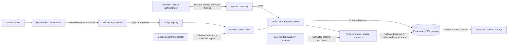

# Threat model

Reviewed scope: one Rust process, bundled browser, local database, external public feed/API ingestion, container build/release workflow, and an isolated course deployment. This is a worked model from source inspection, not a penetration-test report. [Risk scores and decisions](risk-register.md) and [findings](findings.md) complete the threat-to-control chain.

## Assets, actors, and trust boundaries

Assets: integrity of displayed intelligence, availability of queries and ingestion, retained CVE evidence, administrator/API tokens, source and CI identities, released image identity, deployment configuration, and assessment evidence. Public upstream content does not make operational tokens, unpublished run URLs, or environment identifiers public.

Actors: reader, refresh administrator, contributor, code reviewer, release publisher, platform operator, upstream provider, compromised feed provider, malicious pull-request author, and an attacker with access to a container or stolen token. Readers need no mutation rights. External feed providers are untrusted input suppliers even when their assertions are labelled authoritative for a particular data field.

The deployment-to-volume and upstream-to-parser edges are separate boundaries. TLS authenticates transport endpoints; it does not validate advisory truth. A successful readiness probe demonstrates database access, not current source data. A signature/attestation demonstrates an identity-related claim about an artifact, not absence of malicious behavior.

## Abuse cases and controls

| Threat / risk | Abuse scenario | Control mechanism | Adverse evidence to collect |
|---|---|---|---|
| T01 / R01 | An unauthenticated client repeatedly requests expensive refreshes | Strong public-bind token requirement; refresh authentication; bounded queue/coalescing; demo refresh disabled | Missing/incorrect token is denied; demo refresh cannot contact an upstream; duplicate refresh does not create unbounded work |
| T02 / R02 | Malicious RSS or advisory content delivers script markup or dangerous URLs | Browser text escaping/protocol restriction, CSP/security headers, output validation | Render hostile fixture without execution; reject non-HTTP(S) URLs; inspect CSP and browser console |
| T03 / R03 | PR changes pipeline code to steal publication credentials or publish a different artifact | Read-only PR permissions; explicit privileged release; reviewed commit; digest and provenance | Fork/untrusted change receives no publishing permission; release gate failure prevents publishing |
| T04 / R04 | Oversized/compressed source response or expensive XML consumes resources | Stream/body bounds, source timeout, concurrency limits, isolated parser and adapter failures | Oversized and malformed local responses fail with bounded memory/time while other sources continue |
| T05 / R05 | A bad rollout or volume failure destroys the sole local database | Persistent storage, single writer/replica, database-aware backup, guarded restore, compatible rollback | Restore a valid backup into disposable data; reject altered/corrupt backup; measure integrity and readiness |
| T06 / R06 | A compromised dependency/base image/build action inserts malicious code | Lockfile, restricted workflow identity, static/dependency/image/secret checks, SBOM and release evidence | Inspect actual scan and provenance against exact digest; explain what these tools cannot detect |
| T07 / R07 | A configured source URL or redirect reaches metadata/private services | Public destination/redirect and resolved-address checks; source configuration controlled by maintainers; network policies and approved egress | Deny private/metadata targets in authorized lab; record remaining platform/DNS/egress assumptions |
| T08 / R08 | Tokens or personal information escape through logs, artifacts, backups or screenshots | Token files/secret stores, minimized errors and access, redacted evidence, no real data in demo | Inspect logs on failure, check repository/artifacts for leaks, rotate a test token and prove old value is rejected |
| T09 / R09 | Namespace identity gains control of adjacent projects or the pod gains host privilege | Namespace scoping, service-account token controls, non-root/restricted container configuration, policy gate | Scoped identity cannot access another namespace; prohibited manifest is rejected; pod has no excessive privileges |
| T10 / R10 | Misleading or stale source assertions cause wrong analyst prioritization | Per-source evidence, confidence/disagreement model, refresh/source health, explicit demo state | Conflicting source fixture remains visible; distinguish readiness from last successful live update |
| T11 / R11 | AI suggests unsafe automation and generates persuasive unsupported assessment claims | Explicit AI disclosure, independent tests/source review, human approval of adoption, pending evidence labels | Reviewer checks an adverse test and challenges one assumption; no generated attendance/peer/approval records |
| T12 / R12 | Quota/cost exhaustion or abandoned resources outlive the course | Bounded resources and refresh, expiry/ownership labels, backup retention, teardown procedure | Inventory only course resources; observe shutdown/deletion of those resources; retain sanitized evidence first |

Top three: R01 limits immediate mutation abuse; R03 protects every downstream release; R05 protects the only durable dataset. R07 remains a deployment concern even with valid URL schemes: syntax checks alone do not constrain the destination after DNS resolution or redirection.

## Test boundary

Default exercises target only an owned local instance in demo mode, disposable data directories, and explicit course namespaces. Do not direct DAST or fault injection at public feeds or third-party infrastructure. A student's T0 record identifies the actual authorized target, permission owner, allowed test types/time, data policy and stop condition. This example does not invent such permission.

Stop an exercise if it leaves the named environment, affects unrelated resources, exposes a secret, or makes the only recoverable data copy unavailable. Preserve a redacted incident record and restore only from a verified copy using the operational procedure.
